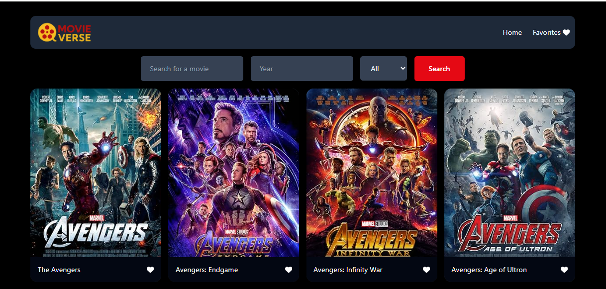
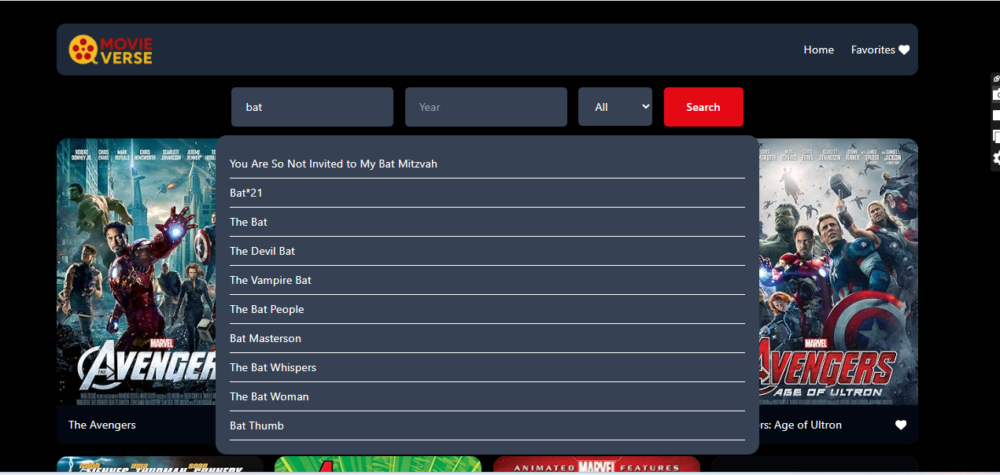
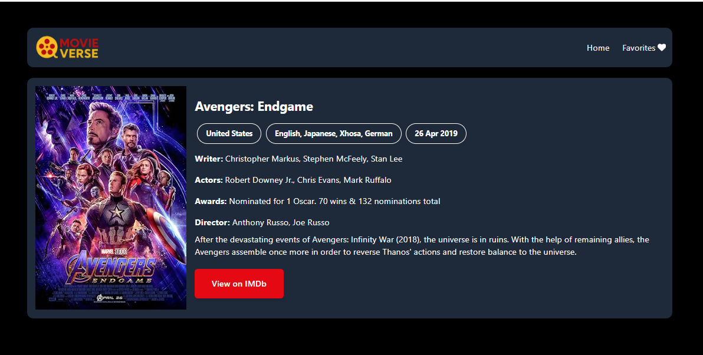

# 🎬 MovieVerse

MovieVerse is a modern React + Tailwind CSS application for exploring movies.  
Users can search, view details, and manage favorites in a cinematic, responsive UI.

---

## 🚀 Features

- 🔍 Search movies with smooth autocomplete
- 🎥 View detailed movie cards (title, poster, year, type)
- ❤️ Add/remove favorites with instant feedback
- 🎨 Custom MovieVerse branding (colors, fonts, logo)
- 📱 Responsive design for mobile, tablet, and desktop
- ⚡ Built with React, Tailwind CSS, React Router

---

## 🛠️ Tech Stack

- **React** (component-based architecture)
- **Tailwind CSS** (utility-first styling)
- **React Router** (navigation)
- **OMDb API** (movie data source)

---

## 📦 Installation

Clone the repository:

````bash
git clone https://github.com/your-username/movieverse-app.git
cd movieverse-app
Install dependencies:
```bash
npm install
````

Create a .env file in the project root:

```bash
VITE_MOVIE_API_KEY=your_api_key_here
```

Start the development server:

```bash
npm run dev
```

📄 Environment Variables
This project uses an API key from OMDb.
Add the following to your .env file:

```bash
VITE_MOVIE_API_KEY=your_api_key_here
```

📸 Screenshots

### Home page with default listing



### Movie Search with suggestions



### Movie detail page



📜 License
This project is licensed under the MIT License.
